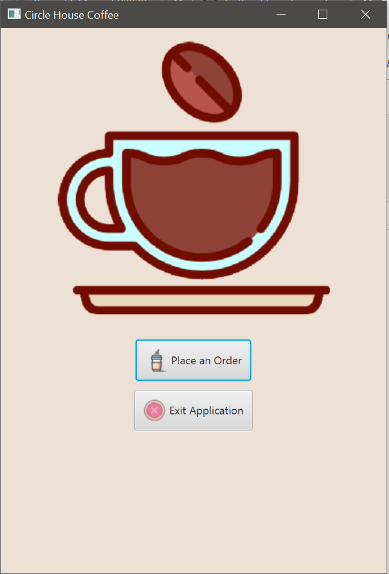

# Coffee-Shop-Transaction-Application
<h2><strong>Description:</strong></h2>

Using the Decorator design pattern to build a Basic Coffee, that can be decorated with additions of Cream, Sugar, Extra Shot, Nut Milk, and Flavor Syrup. 

<h2><strong>Implementation Details:</strong></h2>

Project created as a Maven project, GUI developed using JavaFX, and project tested using JUnit testing framework. 

<h2><strong>Application GUI:</strong></h2> 

